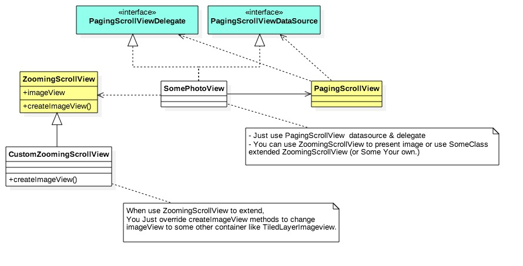

# PGPhotoViewer

The Simplest PhotoViewer

it contains the following components:

1. paging scrollview : for photo swiping.
2. zooming scrollview : for zooming image view.

you can use each control, if you needed it.

# Explain with diagram.

# Installation with CocoaPods

Podfile:

    source 'https://github.com/CocoaPods/Specs.git'
    use_frameworks!

    pod 'PGPhotoViewer'

Then, run the following command:

    $ pod install (or update)

appetize.io demo : [\[ here \]](https://appetize.io/embed/8bz06hbr1vfjzmuwcj5vwa6q9g?device=iphone5s&scale=75&orientation=portrait&osVersion=9.3)

## Author

suwan.park, ipagong.dev@gmail.com
